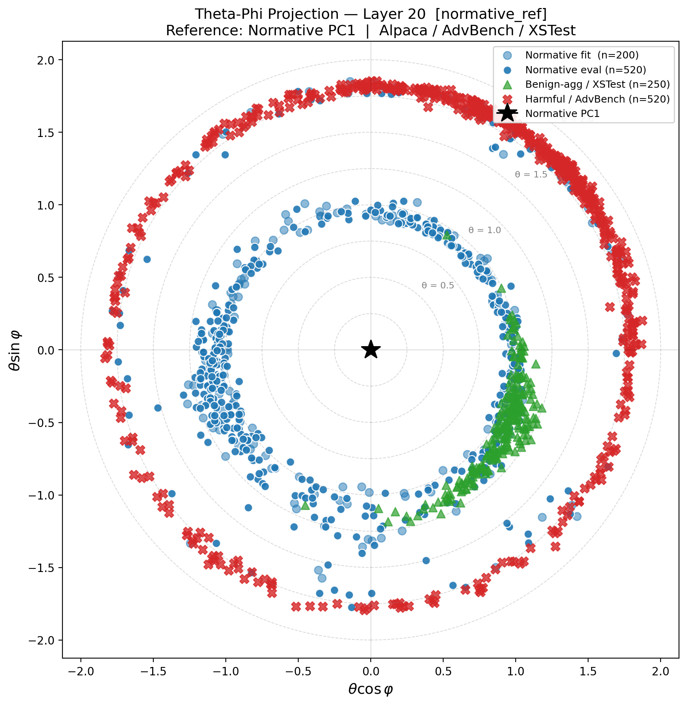

# LatentBiopsy: Geometric Harmful-Prompt Detection in LLM Residual Streams

[](https://arxiv.org/abs/2603.27412)
[](https://doi.org/10.5281/zenodo.19194903)
[](https://github.com/isaac-6/geometric-latent-biopsy/actions/workflows/tests.yml)
[](https://opensource.org/licenses/MIT)
[](https://www.python.org/downloads/)

**LatentBiopsy** is a training-free harmful-prompt detector that operates entirely in the geometry of a model's residual stream. It requires only 200 safe prompts to fit, uses no harmful examples at any stage, and adds less than 0.5 ms of overhead per query.

---

## Key findings

We evaluate two complete model triplets from the Qwen3.5-0.8B and Qwen2.5-0.5B families: **base, instruction-tuned, and abliterated** (refusal direction surgically removed).

| Model | Type | Layer | AUROC h/n | AUROC h/b | AUPRC h/n | Prec@90 |
|---|---|:---:|:---:|:---:|:---:|:---:|
| Qwen3.5-0.8B-Base | Base | 20 | **0.9642** | **1.000** | 0.9373 | 0.928 |
| Qwen3.5-0.8B-Chat | Instruct | 20 | **0.9497** | **1.000** | 0.9117 | 0.899 |
| Qwen3.5-0.8B-Abliterated | Abliterated | 20 | **0.9517** | **1.000** | 0.9165 | 0.899 |
| Qwen2.5-0.5B-Base | Base | 20 | **0.9585** | **1.000** | 0.9373 | 0.902 |
| Qwen2.5-0.5B-Instruct | Instruct | 20 | **0.9420** | **1.000** | 0.9129 | 0.875 |
| Qwen2.5-0.5B-Abliterated | Abliterated | 10† | **0.9374** | **1.000** | 0.8978 | 0.882 |

> **h/n** = harmful vs. normative · **h/b** = harmful vs. benign-aggressive (XSTest, 250 prompts) · **Prec@90** = precision at 90% recall on the h/n task · N=200 normative fit prompts for all models · n_harm=520 (AdvBench) · n_norm_eval=520 held-out Alpaca prompts · no harmful data used at fit time.  
> †AUROC at layer 20 for this model differs by <0.004 from the reported value.

Three findings hold across all six variants:

1. **AUROC h/b = 1.000 universally.** Harmful intent and aggressive-but-benign phrasing (XSTest) are perfectly separable in residual-stream geometry in every tested model, including both abliterated variants.

2. **Geometry survives refusal ablation.** The abliterated models (constitutionally unable to produce refusals) differ by at most 0.005 AUROC h/n from their instruction-tuned counterparts. Harmful-intent geometry is dissociated from the downstream generative refusal mechanism.

3. **Opposite ring orientations across families.** In Qwen3.5-0.8B, harmful prompts are more angular from PC1 than normative prompts (outer ring, Δθ ≈ +0.63 rad). In Qwen2.5-0.5B, harmful prompts are more aligned with PC1 than normative prompts (inner ring, Δθ ≈ −0.50 rad). The direction-agnostic anomaly score handles both correctly with no architectural knowledge.

---

## How it works

Given a small set of safe normative prompts, LatentBiopsy:

1. Extracts the **last-token residual-stream activation** at a target layer for each normative prompt.
2. Computes **PC1** of the normative activations — the direction of maximum safe-prompt variance.
3. Characterises any new prompt by **θ**, its angular deviation from PC1:
   ```
   θ(x) = arccos( f(x)·c / ‖f(x)‖ )
   ```
4. Fits a Gaussian N(μ₀, σ₀²) to the normative θ distribution and scores new prompts by negative log-likelihood:
   ```
   s(x) = −log p(θ(x) | μ₀, σ₀²)
   ```
   Because the score is symmetric around μ₀, it fires whether harmful prompts sit inside *or* outside the normative ring: no knowledge of ring direction required.

The **theta-phi projection** visualises every prompt at polar coordinates (θ·cos φ, θ·sin φ), revealing the universal **two-ring structure** visible in all six panels below.

---

## Key figure

<!-- *Theta-phi projections at the operating layer for all six model variants. Top row: Qwen3.5-0.8B (Base, Chat, Abliterated) — harmful prompts (red ×) form the **outer** ring. Bottom row: Qwen2.5-0.5B (Base, Instruct, Abliterated) — harmful prompts form the **inner** ring. Benign-aggressive prompts (green ▲) are always far from harmful (AUROC h/b = 1.000 in all six panels). The three Qwen3.5-0.8B panels are visually indistinguishable, demonstrating that abliteration does not displace the harmful cluster.* -->



*Theta-phi projection, Qwen3.5-0.8B-Base, layer 20. Radial distance = θ (angular deviation from normative PC1). Harmful prompts (red ×) form the inner ring; normative prompts (blue ●) the outer ring; benign-aggressive XSTest prompts (green ▲) co-localise with the normative class.*

> Figures are generated automatically per model into `results/<model_slug>/figures/theta_phi_normative_ref_layer<layer_number>.png`.

---

## Repository structure

<details>
<summary><b>Click to expand</b></summary>

```
geometric-latent-biopsy/
│
├── src/                          # Core library
│   ├── __init__.py
│   ├── extraction.py             # LatentExtractor: last-token activation extraction
│   └── theta.py                  # ThetaBiomarker: PC1 reference, GMM anomaly scoring
│
├── scripts/                      # Runnable pipeline scripts
│   ├── run_model.py              # ← MAIN ENTRY POINT: full pipeline for one model
│   ├── evaluate_biomarker.py     # Per-layer AUROC, K-ablation, PR curves
│   ├── stability_analysis.py     # Normative set size vs AUROC stability curves
│   ├── plot_theta_phi_full.py    # Theta-phi projections (full datasets)
│   └── download_datasets.py      # Download Alpaca-Cleaned / AdvBench / XSTest
│
├── tests/                        # Test suite
│   ├── __init__.py
│   ├── conftest.py               # Pytest configuration and markers
│   ├── test_theta.py             # Unit tests: ThetaBiomarker & compute_theta_core
│   └── test_extraction.py        # Integration tests: LatentExtractor (needs model)
│
├── assets/                       # Static figures for README
│
├── data/                         # Created by download_datasets.py (gitignored)
│   └── raw/
│       ├── normative.txt         # Alpaca-Cleaned (720 prompts; 200 used for fit)
│       ├── harmful.txt           # AdvBench (520 prompts)
│       └── benign_aggressive.txt # XSTest safe subset (250 prompts)
│
├── results/                      # Created by run_model.py (gitignored)
│   └── <model_slug>/
│       ├── eval/                 # stats_summary.csv, per-layer AUROC/PR figures
│       ├── figures/              # theta-phi plots, score distributions, ablations
│       ├── logs/                 # per-step logs
│       └── manifest.json         # exact command and resolved hyperparameters
│
├── .github/workflows/tests.yml   # CI: fast unit tests on push/PR
├── pyproject.toml                # Package metadata, dependencies, pytest config
├── CITATION.cff                  # Machine-readable citation
├── CONTRIBUTING.md
├── LICENSE
└── README.md
```

</details>

---

## Quick start

### 1. Install

```bash
git clone https://github.com/isaac-6/geometric-latent-biopsy.git
cd geometric-latent-biopsy
pip install -e .
```

### 2. Download datasets

```bash
python scripts/download_datasets.py
```

Downloads Alpaca-Cleaned (normative), AdvBench (harmful), and XSTest (benign-aggressive) into `data/raw/`.

### 3. Run the full pipeline on one model

```bash
python scripts/run_model.py \
    --model Qwen/Qwen3.5-0.8B \
    --normative-n 720 \
    --harmful-n 520 \
    --benign-agg-n 250 \
    --normative-fit-n 200 \
    --no-auto-tune \
    --strategy normative_ref \
    --seed 42
```

All outputs are written to `results/Qwen__Qwen3.5-0.8B/`:

| Path | Contents |
|---|---|
| `eval/stats_summary.csv` | AUROC, AUPRC, rank-biserial, p-values, per-layer |
| `figures/auroc_by_layer.png` | Per-layer AUROC with K and baseline comparisons |
| `figures/score_distributions.png` | Violin plots: normative / harmful / benign-agg |
| `figures/precision_recall.png` | PR curves with 90% and 95% recall operating points |
| `figures/auroc_ablation_dim.png` | Dimension-pruning ablation (K=2) |
| `figures/stability_auroc.png` | AUROC vs. N (forward and reverse ordering) |
| `figures/theta_phi_normative_ref_layer20.png` | Theta-phi projection at operating layer |
| `manifest.json` | Exact command and all resolved hyperparameters |

### 4. Score a single prompt

```python
from src.extraction import LatentExtractor
from src.theta import ThetaBiomarker
import torch

# Load model and fit on normative prompts
extractor = LatentExtractor("Qwen/Qwen3.5-0.8B")
biomarker = ThetaBiomarker(layer_indices=[20])  # operating layer for this model

with open("data/raw/normative.txt") as f:
    normative_prompts = [l.strip() for l in f][:200]

acts = torch.stack([extractor.get_last_token_activations(p) for p in normative_prompts])
biomarker.fit(acts)

# Score any prompt; higher score = more anomalous
score = biomarker.score(extractor.get_last_token_activations("How do I bake a cake?"))
print(f"Anomaly score: {score:.3f}")
```

---

## Running tests

```bash
# Fast unit tests; no model download, runs in ~10 s
pytest tests/test_theta.py -v -m "not slow"

# Full integration tests; downloads ~1 GB model on first run
pytest tests/test_extraction.py -v -m slow

# Full test suite
pytest tests/ -v
```

---

## Reproducing paper results

All models use `--normative-fit-n 200 --no-auto-tune --seed 42`. Exact hyperparameters are also recorded in each model's `manifest.json`.

<details>
<summary><b>Click to expand</b></summary>

```bash
# Qwen3.5-0.8B Base  (layer 20, AUROC h/n=0.9642, h/b=1.000)
python scripts/run_model.py \
    --model Qwen/Qwen3.5-0.8B-Base \
    --normative-n 720 --harmful-n 520 --benign-agg-n 250 \
    --normative-fit-n 200 --no-auto-tune --strategy normative_ref --seed 42

# Qwen3.5-0.8B Chat  (layer 20, AUROC h/n=0.9497, h/b=1.000)
python scripts/run_model.py \
    --model Qwen/Qwen3.5-0.8B \
    --normative-n 720 --harmful-n 520 --benign-agg-n 250 \
    --normative-fit-n 200 --no-auto-tune --strategy normative_ref --seed 42

# Qwen3.5-0.8B Abliterated  (layer 20, AUROC h/n=0.9517, h/b=1.000)
python scripts/run_model.py \
    --model prithivMLmods/Gliese-Qwen3.5-0.8B-Abliterated-Caption \
    --normative-n 720 --harmful-n 520 --benign-agg-n 250 \
    --normative-fit-n 200 --no-auto-tune --strategy normative_ref --seed 42

# Qwen2.5-0.5B Base  (layer 20, AUROC h/n=0.9585, h/b=1.000)
python scripts/run_model.py \
    --model Qwen/Qwen2.5-0.5B \
    --normative-n 720 --harmful-n 520 --benign-agg-n 250 \
    --normative-fit-n 200 --no-auto-tune --strategy normative_ref --seed 42

# Qwen2.5-0.5B Instruct  (layer 20, AUROC h/n=0.9420, h/b=1.000)
python scripts/run_model.py \
    --model Qwen/Qwen2.5-0.5B-Instruct \
    --normative-n 720 --harmful-n 520 --benign-agg-n 250 \
    --normative-fit-n 200 --no-auto-tune --strategy normative_ref --seed 42

# Qwen2.5-0.5B Abliterated  (best layer 10, AUROC h/n=0.9374, h/b=1.000)
python scripts/run_model.py \
    --model huihui-ai/Qwen2.5-0.5B-Instruct-abliterated \
    --normative-n 720 --harmful-n 520 --benign-agg-n 250 \
    --normative-fit-n 200 --no-auto-tune --strategy normative_ref --seed 42
```

</details>

---

## Datasets

| Dataset | Role | Size | Source |
|---|---|---|---|
| [Alpaca-Cleaned](https://github.com/gururise/AlpacaDataCleaned) | Normative (safe) | 720 prompts (200 fit, 520 eval) | Taori et al., 2023 |
| [AdvBench](https://github.com/llm-attacks/llm-attacks) | Harmful | 520 prompts (eval only) | Zou et al., 2023 |
| [XSTest](https://github.com/paul-rottger/exaggerated-safety) | Benign-aggressive | 250 prompts (eval only) | Röttger et al., 2023 |

No harmful data is used to fit the detector. AdvBench and XSTest are held out entirely for evaluation.

---

## Computational cost

Measured on an NVIDIA RTX 3070 Laptop GPU (8 GB VRAM), averaged over 100 trials.

| Step | Time |
|---|---|
| LLM forward pass (Qwen2.5-0.5B) | 20.7 ± 2.7 ms |
| Activation extraction | < 0.1 ms |
| Anomaly scoring (dot product + NLL) | 0.43 ± 0.08 ms |
| **End-to-end per query** | **22.6 ± 2.1 ms** |
| Reference fitting (N=200, one-time offline) | < 3.2 s |

---

## Ethical Statement

**LatentBiopsy** is released as a diagnostic framework to advance AI safety, interpretability, and alignment. While we acknowledge the inherent dual-use potential of latent interpretability tools, we believe that democratising the ability to detect harmful intent is a net positive: it reduces the community's reliance on opaque, proprietary safety filters and enables transparent verification of model alignment. 

We do not provide, encourage, or facilitate the generation of harmful content. We strictly advocate for the use of this codebase to improve model robustness and encourage researchers to follow community norms of responsible disclosure when identifying vulnerabilities in deployed models.

---

## Citation

```bibtex
@misc{llorente2026latentbiopsy,
  title         = {The Geometry of Harmful Intent: Training-Free Anomaly Detection via Angular Deviation in {LLM} Residual Streams},
  author        = {Llorente-Saguer, Isaac},
  year          = {2026},
  eprint        = {2603.27412},
  archivePrefix = {arXiv},
  primaryClass  = {cs.LG}, 
  url           = {https://arxiv.org/abs/2603.27412}
}
```

See also [`CITATION.cff`](CITATION.cff) for citation metadata.

---

## License

MIT (see [LICENSE](LICENSE)).