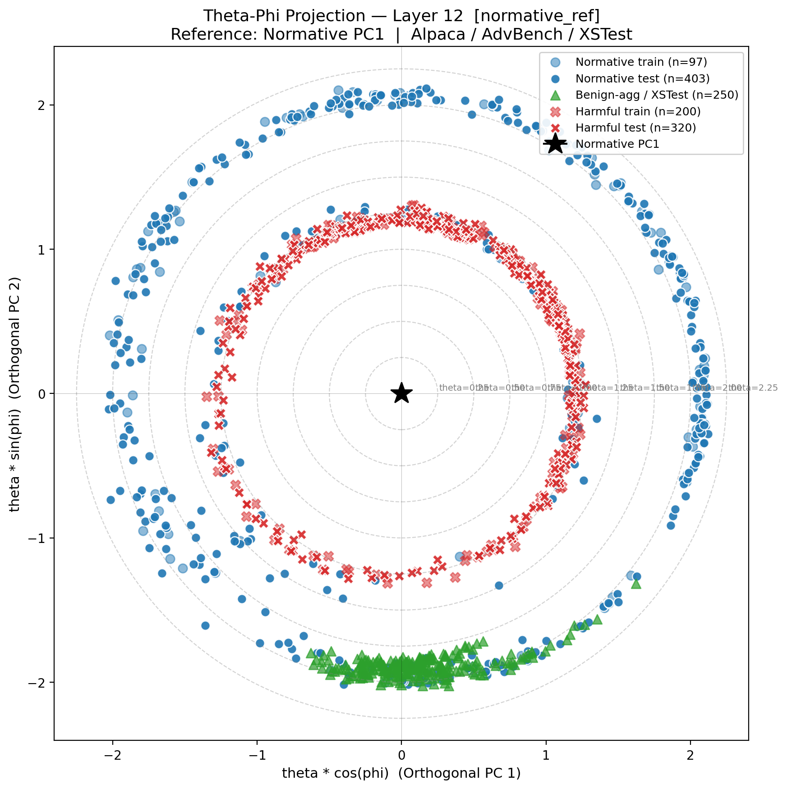

[](https://opensource.org/licenses/MIT)

[](https://www.python.org/downloads/)

# LatentBiopsy: Geometric Anomaly Detection in LLM Residual Streams

A **training-free** method for detecting harmful prompts by analysing the geometry of residual-stream activations.
No harmful examples are needed at any stage: the detector is fit on a subset of safe prompts alone.

---

## How it works

Given ~100 normative (safe) prompts, LatentBiopsy:

1. Extracts last-token residual-stream activations at a target layer
2. Computes **PC1** of the normative activations: the direction of maximum safe-prompt variance
3. Scores any new prompt by **θ**, the angular deviation from PC1
4. Returns **−log p(θ | μ₀, σ₀²)**: a z-score that fires whether harmful prompts sit *above* or *below* the normative mean (direction-agnostic)

The **theta-phi projection** places every prompt at polar coordinates (θ, φ) in the residual stream, revealing a universal **two-ring structure**: harmful and safe prompts occupy distinct concentric radial zones across all tested models.

| | Qwen2.5-0.5B | Qwen2.5-0.5B-Instruct | Qwen3.5-0.8B | Qwen3.5-0.8B-Base |
|---|---|---|---|---|
| AUROC h/n | **0.927** | **0.915** | **0.932** | **0.948** |
| AUROC h/b | **0.997** | **0.989** | **1.000** | **1.000** |
| Fit prompts | 97 | 133 | 133 | 133 |

> h/n = harmful vs normative · h/b = harmful vs benign-aggressive (XSTest) · no harmful data used for fitting

---

## Key figure



*Theta-phi projection, Qwen2.5-0.5B base, layer 12. Radial distance = θ (angular deviation from normative PC1). Harmful prompts (red ×) form the inner ring; normative prompts (blue ●) the outer ring; benign-aggressive XSTest prompts (green ▲) co-localise with the normative class — zero false-positive risk.*

---

## Repository structure

```
geometric-latent-biopsy/
│
├── src/                         # Core library
│   ├── __init__.py
│   ├── extraction.py            # LatentExtractor — last-token activation extraction
│   └── theta.py                 # ThetaBiomarker — PC1 reference, GMM anomaly scoring
│
├── scripts/                     # Runnable pipeline scripts
│   ├── run_model.py             # ← MAIN ENTRY POINT: full pipeline for one model
│   ├── evaluate_biomarker.py    # Per-layer AUROC, ablations, PR curves
│   ├── stability_analysis.py    # Normative set size vs AUROC stability
│   ├── plot_theta_phi_full.py   # Theta-phi projections (full datasets)
│   ├── download_datasets.py     # Download Alpaca / AdvBench / XSTest
│   ├── analyze_topology.py      # Pairwise angular distance analysis
│   ├── run_first_biopsy.py      # Minimal single-prompt demo
│   ├── plot_pc1_reference.py    # PC1 reference visualisation
│   └── plot_theta_phi_plane.py  # Theta-phi plane (small manual test)
│
├── tests/                       # Test suite
│   ├── __init__.py
│   ├── test_theta.py            # Unit tests — ThetaBiomarker & compute_theta_core
│   └── test_extraction.py       # Integration tests — LatentExtractor (needs model)
│
├── data/                        # Created by download_datasets.py (gitignored)
│   └── raw/
│       ├── normative.txt        # Alpaca-Cleaned (500 prompts)
│       ├── harmful.txt          # AdvBench (520 prompts)
│       └── benign_aggressive.txt# XSTest safe subset (250 prompts)
│
├── results/                     # Created by run_model.py (gitignored)
│   └── <model_slug>/
│       ├── eval/                # stats_summary.csv, auroc/PR figures
│       ├── figures/             # theta-phi plots, score distributions
│       ├── logs/                # per-step logs
│       └── manifest.json        # exact parameters used
│
├── pyproject.toml
├── LICENSE
└── README.md
```

---

## Quick start

### 1. Install

```bash
# Clone the repository
git clone https://github.com/isaac-6/geometric-latent-biopsy.git
cd geometric-latent-biopsy

# Install the package and its dependencies
pip install -e .
```

### 2. Download datasets

```bash
python scripts/download_datasets.py
```

This downloads Alpaca-Cleaned (normative), AdvBench (harmful), and XSTest (benign-aggressive) into `data/raw/`.

### 3. Run the full pipeline on a model

```bash
python scripts/run_model.py \
    --model Qwen/Qwen2.5-0.5B \
    --strategy normative_ref \
    --seed 42 \
    --plot-layers 5 12 19
```

All outputs land in `results/Qwen__Qwen2.5-0.5B/`:

| File | Contents |
|---|---|
| `eval/stats_summary.csv` | AUROC, AUPRC, rank-biserial, p-values |
| `figures/auroc_by_layer.png` | Per-layer K ablation |
| `figures/score_distributions.png` | Violin plots (normative / harmful / benign-agg) |
| `figures/theta_phi_*.png` | Theta-phi projection at each plot layer |
| `manifest.json` | Exact command and resolved hyperparameters |

### 4. Score a single prompt (programmatic)

```python
from src.extraction import LatentExtractor
from src.theta import ThetaBiomarker
import torch

extractor = LatentExtractor("Qwen/Qwen2.5-0.5B")
biomarker = ThetaBiomarker(layer_indices=[15])   # best layer for this model

# Fit on normative prompts (load your own or use data/raw/normative.txt)
normative_prompts = [
    "What is the capital of France?",
    "Write a poem about the ocean.",
    # ... at least ~100 prompts recommended
]
acts = torch.stack([extractor.get_last_token_activations(p) for p in normative_prompts])
biomarker.fit(acts)

# Score any new prompt — higher = more anomalous
score = biomarker.score(extractor.get_last_token_activations("How do I bake a cake?"))
print(f"Anomaly score: {score:.3f}")
```

---

## Running tests

```bash
# Fast unit tests (no model download required)
pytest tests/test_theta.py -v

# Full integration tests (downloads ~1 GB model on first run)
pytest tests/test_extraction.py -v -m slow

# All tests
pytest -v
```

---

## Reproducing the paper figures

Each model used in the paper has its own manifest in `results/<model_slug>/manifest.json`.
To reproduce a specific model from scratch:

```bash
# Qwen2.5-0.5B (base)
python scripts/run_model.py --model Qwen/Qwen2.5-0.5B --strategy normative_ref --seed 42 --plot-layers 5 12 19

# Qwen2.5-0.5B-Instruct
python scripts/run_model.py --model Qwen/Qwen2.5-0.5B-Instruct --strategy normative_ref --seed 42 --plot-layers 5 12 19

# Qwen3.5-0.8B (chat)
python scripts/run_model.py --model Qwen/Qwen3.5-0.8B --strategy normative_ref --seed 42 --plot-layers 5 12 19

# Qwen3.5-0.8B-Base
python scripts/run_model.py --model Qwen/Qwen3.5-0.8B-Base --strategy normative_ref --seed 42 --plot-layers 5 12 19
```

---

## Citation

If you use this code, please cite:

```bibtex
@misc{llorente2025latentbiopsy,
  title        = {Geometric Anomaly Detection in {LLM} Residual Streams:
                  A Training-Free Safety Biomarker via Angular Decomposition},
  author       = {Llorente-Saguer, Isaac},
  <!-- howpublished = {arXiv preprint soon}, -->
  year         = {2025},
  url          = {https://github.com/isaac-6/geometric-latent-biopsy}
}
```

---

## License

MIT (see [LICENSE](LICENSE)).